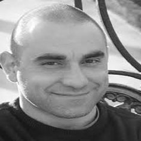
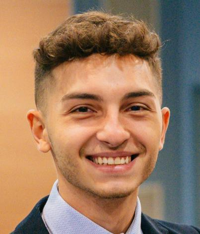

# About Us
We are members of the research team at the _Computer Vision and Pattern Recognition Laboratory (CVPRLab) "Alfredo Petrosino"_, at Department of Science and Technology, Parthenope University of Naples.

**Alessio Ferone** (Principal Investigator)
 has been Assistant Professor in Computer Science at University Parthenope of Naples since December 2008. He took a PhD in Computer Science at University of Milan in 2011. Since 2010 he teaches Image Analysis, Computer Vision in the M. Sc. and B. Sc. in Computer Science. He is the vice-head of Computer Vision and Pattern Recognition "Alfredo Petrosino" Laboratory, affiliated to CVPL, Italian Chapter of IAPR.
He participated to many research projects, and he is coordinating the activities of the project "ESPLORA: Exoplanet Spectroscopy at high resolution to Probe their Lost Origins by Revealing their Atmospheric compositions".
He is a senior IEEE member and CVPL (affiliated IAPR) member. He published about 40 papers on peer-reviewed journals and conference proceedings. The overall number of his citations in Google Scholar is 350 (H-index is 9).

**Massimiliano Giordano Orsini** (Project Collaborator)
 received the B.S. degree in Computer Science from the University of Naples Parthenope, in 2022, and the M.S. degree in Applied Computer Science (Machine Learning \& Big Data) from the University of Naples Parthenope, in 2024, where he is currently pursuing the Ph.D. degree in "Environment, Resources and Sustainable Development", with previous internship experience in research on the application of machine learning techniques for the removal of telluric spectra from spectroscopic observations. His current research interests include exoplanetary atmospheric retrieval, machine learning, deep generative modeling, and computer vision.

## Contact
- Email: alessio.ferone@uniparthenope.it
- Email: massimiliano.giordanoorsini001@studenti.uniparthenope.it
