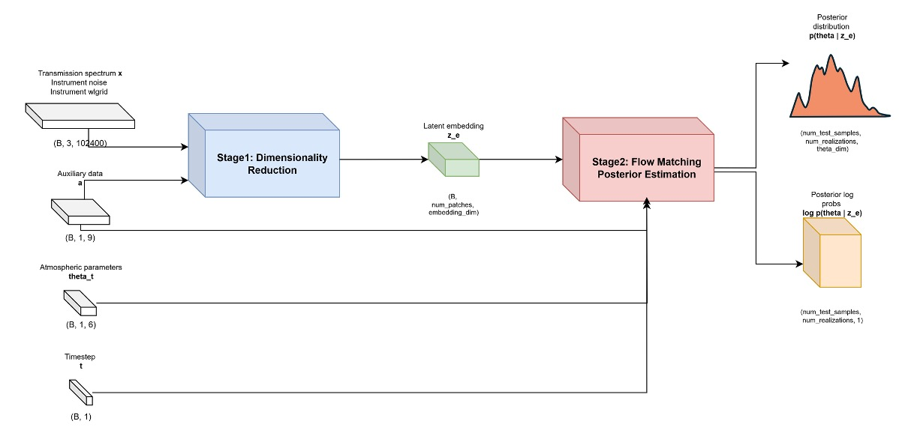
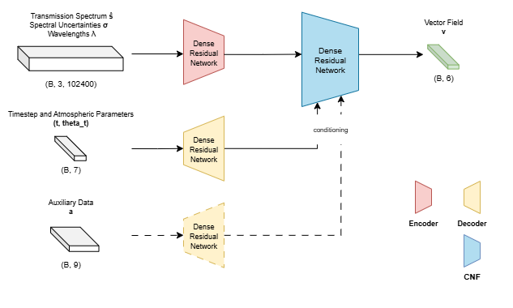
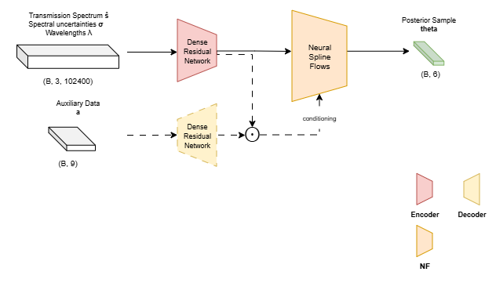

# Project Documentation

## Introduction
The characterization of exoplanetary atmospheres allows a deeper understanding of planetary formation, evolution, and habitability through atmospheric retrieval. The growing interest in these topics is confirmed by the expected launch in 2029 of the Atmospheric Remote-sensing Infrared Exoplanet Large-survey (ARIEL; [[2](@tinetti2018ariel)]) space mission by the European Space Agency, which will conduct a four-year large-scale spectral survey of transiting exoplanets at various levels of detail. Atmospheric retrieval refers to the fundamental process of inferring the chemical properties of the exoplanetary atmospheres [[3](@madhusudhan2018retrieval)]. During the last two decades, a plethora of exoplanet atmospheric retrieval codes have been developed, demonstrating the large interest in this research topic [[4](@macdonald2023catalog)]. Currently, the state-of-the-art atmospheric retrieval methods are based on Bayesian inference [[5](@skilling2006nested), [6](@feroz2009multinest), [7](@buchner2021ultranest)]. However, in certain cases these methods require several weeks to produce a full posterior distribution of atmospheric parameters given observed spectra. With the expected volume of incoming observations, traditional methods become simply impractical. Furthermore, the scalability requirement for atmospheric retrieval methods is supported by the need of high-resolution spectroscopic observations for accurate retrievals. Thanks to the increased sensitivity of high-resolution instruments, spectral bands can be decomposed into a dense forest of individual spectral lines, enabling precise molecular identification at the cost of significant computational burden [[8](@birkby2018spectroscopic)]. To address these challenges, we propose a novel atmospheric retrieval framework based on Continuous Normalizing Flows (CNFs; [[9](@chen2018neuralode)]) trained via Optimal-Transport Conditional Flow Matching (OT-CFM; [[10](@lipman2023flowmatching)]) to compute the joint posterior distribution of atmospheric parameters in a similar fashion to [[11](@gebhard2024flowmatching-atmospheres)].

## Methods
CNFs [[9](@chen2018neuralode)] are a class of deep generative models that learn the probability flow from simple, easy-to-sample distributions to complex, high-dimensional probability distributions. Recently, OT-CFM [[10](@lipman2023flowmatching)] has been introduced as a simulation-free training paradigm based on regressing vector fields of fixed conditional probability paths, enabling for scalable training and sampling. 

Unlike conventional neural networks that produce point estimates, CNFs can approximate the full posterior distribution of atmospheric parameters given observed spectra by solving the corresponding ODE formulation through multiple neural function evaluations (NFEs). 

Compared to NS, our CNF-based retrieval framework offers several advantages:
* First, it significantly accelerates inference as the time needed for multiple NFEs to solve the ODE formulation is significantly less than the time required by sampling methods to produce a posterior sample; once trained, the model can generate a full posterior distribution in few hours, making it ideal for large-scale exoplanet characterization studies. 

* Second, CNFs enables not only the generation of posterior samples but also the computation of the corresponding log-probabilities. 

* Third, the flexibility of CNFs allows for seamless adaptation to different observational setups (e.g. low/high-resolution, ground/space-based instruments, etc.). To the same extent of traditional retrieval methods, CNFs could provide a robust uncertainty quantification. 

We plan to compute the full posterior distributions of atmospheric parameters using CNFs and to evaluate them in terms of calibration and uncertainty quantification, allowing a fair comparison between different statistical models. Our work will leverage NVIDIA's GPU-accelerated libraries, such as CUDA and cuDNN, in Python programming language, and cloud-hosted NVIDIA's hardware.

<!--  !-->

## Overview of the FMPE framework
The FMPE-based retrieval framework is built upon Conditional Flow Matching (CFM; [[10]](@lipman2023flowmatching)), a simulation-free training paradigm of CNFs based on the definition of an Ordinary Differential Equation (ODE), in which we regress onto a target conditional vector field that generates a desired conditional probability path. In this way, we are able to transport samples from an easy-to-sample base distribution (e.g., a standard normal) to the desired data distribution.
Here, we consider the simplest conditional path that is given by the CondOT (or equivalently OT-CFM), based on the optimal transport theory which couples samples between the base and data distributions using a linear interpolation, thus easily providing a closed-form solution of the target conditional vector field.  
FMPE enables the application of CNFs trained with CFM to simulation-based inference (and hence, atmospheric retrieval) just using the Bayes' theorem (see [[11](@gebhard2024flowmatching-atmospheres), [12](@giordanoorsini2025flowmatching)] for additional details).

The FMPE-based retrieval framework is designed to handle heterogeneous data, separately, by incorporating dedicated neural modules.

<!--  !-->

Here we describe its constituent modules:
* **Context Embedding Network.** It compresses the spectral context (i.e., the perturbed transmission spectrum, the original wavelength-dependent spectral uncertainties, and the wavelengths) to a lower-dimensional representation. This module can be parameterized either as a Dense Residual Network or as a Multi-Scale Transformer, as detailed below. Beyond architectural differences, the key distinction between these parameterizations lies in how the inputs are combined: the Dense Residual Network concatenates the individual components sequentially, forming a single high-dimensional vector, whereas the Multi-Scale Transformer organizes them along the channel dimension, preserving alignment across wavelength bins. In the former case, we consider a shallow Dense Residual Network, consisting of just 2 blocks, each producing an hidden representation of size 512. Each block uses Layer Normalization [[16](@ba2016layernorm)], GELU activation function [[17](@hendrycks2016gelu)], and dropout regularization [[18](@srivastava2014dropout)] with $p = 0.1$.

* **Auxiliary Data Embedding Network.** It maps planetary system–related information (not directly contained in the spectral context) into a higher-dimensional latent representation, thereby enriching the conditioning information available to the model and allowing the model to exploit correlations between system-level properties and spectral features. This module is parameterized by a shallow Dense Residual Network, identical to the context embedding network.

* **Timestep and Atmospheric Parameters Embedding Network.** It embeds the time-interpolated atmospheric parameters produced by the FMPE framework, together with the associated continuous timestep, into a higher-dimensional latent representation. To explicitly encode temporal information, a sine–cosine positional encoding is first applied to the timestep. The resulting encoding is then concatenated with the atmospheric parameter vector and processed by a shallow Dense Residual Network, identical to the context embedding network.

* **Continuous Normalizing Flow.** This is meant as the "vector field network", which takes the embedded context and embedded timestep and atmospheric parameters combined with a gated linear unit (GLU; [[22](@dauphin2017gatedconv)]) and is parameterized by a 14-layer Dense Residual Network, with layer sizes decreasing from 2048 to 6 (i.e., the number of atmospheric parameters) to predict the vector field inducing the probability density transport between the base distribution (standard normal) and the data distribution.


### Multi-Scale Transformer Embedding Network

To capture long-range dependencies and multi-resolution structure in the spectral data, the MST-FMPE introduces a Multi-Scale Transformer Encoder as a context embedding network, which takes the spectral context as input and operates on overlapping patches at multiple spectral resolutions. The architecture is designed to jointly model local fine-grained patterns and global contextual information through hierarchical attention and cross-scale information exchange.

* **Multi-Scale Patch Embedding.** To construct multi-scale representations, the spectral context is decomposed into overlapping patches at four distinct scales, defined by patch sizes $\{2048, 4096, 8192, 16384\}$ and corresponding strides $\{256,512,1024,2048\}$.
At each scale, patches are linearly projected into a shared embedding space of dimension 128, producing a sequence of tokens. Smaller patch sizes emphasize local structure with high overlap, while larger patches provide increasingly global context with coarser resolution.

* **Token and Positional Encoding.** We point that the wavelengths naturally encode the positional information of each token and patch. Therefore, we exploit this by simply adding the wavelengths to each token and by adopting a wavelength-based patch-level positional encoding. In particular, we take the median wavelength of each patch, divide out by the minimum of the median wavelengths and transform the resulting vector in log space. Then, we add the obtained positional vector to the patches.

* **Transformer Blocks.** At each scale, the embedded tokens are processed by a stack of Transformer layers [[23](@vaswani2017attention)], with 2 layers per scale. Each layer follows a pre-normalization and post-normalization scheme using RMS normalization [[24](@zhang2019rmsnorm)], improving numerical stability and training robustness. Self-attention is implemented via multi-head self-attention (MHSA) with 4 heads, using a classic attention formulation. Query–key normalization [[25](@henry2020query)] is applied to stabilize attention scores, while the attention scaling factor is fixed rather than learned. The feed-forward network (FFN) within each Transformer block adopts a SwiGLU activation [[26](@shazeer2020glu)], with the hidden dimension expanded by a factor of four relative to the model dimension. Dropout regularization with $p = 0.1$ is applied within the FFN to mitigate overfitting.

* **Cross-Scale Fusion.** To integrate information across resolutions, the architecture employs incremental cross-attention between scales. Representations at finer scales attend to coarser-scale representations through multi-head cross-attention (MHCA), allowing local features to be contextualized by global structure. This progressive fusion strategy ensures that information flows coherently across scales while mantaining a compact latent representation.


## Experimental Setup

### Dataset 
<a href="dataset">

In collaboration with the [Italian National Institute of Astrophysics (INAF)](http://www.inaf.it/en), we build a dedicated high-resolution dataset following the structure of the Ariel Data Challenge 2022 / 2023 datasets [[1](@changeat2023esa-ariel)]. In particular, the dataset comprises 91,392 samples, each including three primary components:
* **Spectral data**, comprising of a 102,400-dimensional _atmospheric spectrum_, providing information on transit depth and covering the _spectral range_ from 0.9 $\mathrm{\mu m}$ to 2.42 $\mathrm{\mu m}$ and _associated measurement uncertainty_.
* **Auxiliary data**, encompassing 9 additional stellar and planetary parameters, such as _star distance, stellar mass, stellar radius, stellar temperature, planet mass, planet radius, orbital period, semi-major axis, and surface gravity_.
* **Target data**, describing 6 atmospheric parameters: _planet temperature_ (in Kelvin, $T_p$), and the log-abundance of five atmospheric gases such as _water_ ($\text{H}_2\text{O}$), _carbon dioxide_ ($\text{CO}_2$), _carbon monoxide_ ($\text{CO}$), _methane_ ($\text{CH}_4$), and _ammonia gas_ ($\text{NH}_3$). These are the input parameters generating the simulated observations.

We split the samples into training, validation, and test sets according to the common 70 (63,973 samples) / 20 (18,278 samples) / 10 (9,140 samples) ratio.


**Data Preprocessing.** To avoid finite-precision numerical issues, the stellar radius and mass are expressed in units of Solar radii and masses, while the planet radius and mass are expressed in units of Jupyter radii and masses. 
Then, stellar and planetary temperatures are transformed in log space to be consistent with the rest of the atmospheric parameters.
Due to the very narrow observed transit depth range ($10^{-5}-10^{-2}$), trasmission spectra and measured uncertainties are scaled by a factor of $10^{3}$.
As required by the flow matching paradigm, target atmospheric parameters and auxiliary data are preprocessed using feature-wise Z-score normalization according to the mean and standard deviation computed on samples of the training set.
Finally, we naturally perform online data augmentation by perturbing each transmission spectrum with scaled Gaussian noise having zero mean and variance given by the square of the associated spectral uncertainties. The scaling factor is bounded in $[0.05, 0.5]$.

### Training Phase

The training phase of all the experiments is executed on a single GPU.

We define a unique training setup for all the experiments, in which we adopt a number of epochs equal to 20 with a batch size of 64 samples, the AdamW optimizer having an initial learning rate equal to $5^{-5}$, with a cosine annealing learning rate scheduler, where the learning rate follows a single cosine decay cycle with a maximum period length $(t_{\text{max}})$ of 20 epochs. This means that the final learning rate will be equal to $5^{-6}$. We use the utility provided by [Weight \& Biases](https://wandb.ai/) for logging the intermediate results of each experiment.

Furthermore, we enable automatic mixed precision to save memory during forward and backward passes for all the FMPE-related experiments, while this option is disabled for NPE-related experiments. Clearly, for each experiment we consider the weights of the model achieving the lowest validation loss.


### Inference Phase
The sampling phase of all the experiments is conducted in a multi-GPU fashion using 4 devices simultaneously. The number of realizations of the posterior distribution given each observed spectrum $q(\theta|x=x_i)$ is set to 2048. Therefore, according to the size of the test set described in [Dataset](#dataset), the total number of generated samples is $18,718,720$.

We define a unique sampling setup for all the experiments, in which we adopt a batch size of 4 and a chunk size of 64. 
To infer the posterior distribution of atmospheric parameters using FMPE, we solve the ODE using the ```rk4``` integration method with a single step. This means that each sample generation requires 4 NFEs, while NPE provides a sample using a single NFE.

Also in this case, we enable automatic mixed precision to save memory during forward passes for all the FMPE-related experiments, while this option is disabled for NPE-related experiments. 


###  Evaluation
To assess the performance of heterogeneous posterior estimators, we established an extensive evaluation framework, including regression errors, uncertainty estimation and calibration, posterior coverage, and distribution discrepancy measures, thus following our prior work on low-resolution trasmission spectroscopy [[12](@giordanoorsini2025flowmatching)].

We recall that all of these predictive aspects provide precious information about the quality of the predicted posterior distributions but to check whether the inference is correct, the analysis should be complemented with posterior predictive checks (PPCs; [[13](@cook2006validation), [14](@gelman2013bayesian)]). These checks involve the comparison between the distribution of the original simulated observations with the posterior predictive distribution obtained by passing the set of posterior samples as input to the simulator. 
Due to the slow sampling speed of our simulator, PPCs cannot be performed in a reasonable amount of time, even considering the modest size of the designed test set.

We perform a comparative analysis including our method, the FMPE baseline, and NPE. We plan to extend the comparison to traditional Bayesian inference methods, such as DE-MCMC [[15](@sherri2017differential)], on a very limited subset of the test set, due to their significant computational cost.

Within this context, our experiments are driven by the following research questions:
#### 1. Is FMPE Still the State-of-the-art in High-resolution Settings?
> High-resolution spectra introduce both opportunities (more detailed molecular signatures) and challenges (larger input dimensions, higher noise sensitivity). While FMPE has demonstrated state-of-the-art results in medium-resolution settings [[11](@gebhard2024flowmatching-atmospheres), [12](@giordanoorsini2025flowmatching)], its scalability and reliability at high-resolution spectra need systematic evaluation, especially considering the dimensionality increase and computational complexity. 
#### 2. Are Transformers Better Encoders for High-resolution Spectral Data?
> High-resolution transmission spectra contain extremely long sequences (102,400 dimensions per spectrum). Traditional encoders in this context, such as Dense Residual Networks, may struggle with the high dimensionality of the spectra and long-range dependencies between spectral lines. Transformers are designed for sequence modeling and may simultaneously handle very high-dimensional spectra and capture the above-mentioned dependencies more effectively.
#### 3. Are Auxiliary Data Beneficial in High-resolution Retrieval?
> Auxiliary data (stellar and planetary parameters) provide contextual information that may complement the spectral input. We already proved their effectiveness in a prior work [[12](@giordanoorsini2025flowmatching)]. At high resolution, the potential of auxiliary data is still unknown.


### Competitors

We compared the performance of MST-FMPE against two baselines: Neural Posterior Estimation (NPE) and a basic variant of FMPE, which uses Dense Residual Networks to parameterize each module. 

**NPE Model.** NPE involves the training of a conditional density estimator which describes the transformation of a probability density (e.g., a standard normal) through a sequence of invertible mappings. Following the implementation provided by the authors in [[11](@gebhard2024flowmatching-atmospheres)], the NPE model consists of two parts:
* **Context Embedding Network.** This module is parameterized by a shallow Dense Residual Network, identical to the context embedding network of the baseline FMPE model.

* **Discrete Normalizing Flow.** We use a neural spline flow (NSF; [[19](@durkan2019neuralsplineflows)]) as implemented by the ```glasflow``` library [[20](@williams2024glasflow)], which is itself based on ```nflows``` [[21](@durkan2020nflows)]. The conditional NSF takes the embedded context as input and consists of 16 steps, each consisting of 4 blocks with 512 units, GELU activation functions [[17](@hendrycks2016gelu)], and dropout regularization [[18](@srivastava2014dropout)] with $p = 0.1$. The number of bins for the splines is 16.

This configuration is designed to match approximatively the number of parameters of the FMPE-based model. 

The NPE models is trained using maximum likelihood estimation (MLE), as Discrete Normalizing Flows are able to compute directly the likelihood of the samples using the change-of-variable formula.

<!--  !-->


## Results and Discussion


Here, we report the parameters, FLOPs, training and sampling times for the methods which are effectively involved in the comparative analysis.

|**Method**  | **Parameters** (M)   | **FLOPs** (G) | **Training Time** (h) | **Sampling Time** (h) |
|------|------|------|------|------|
| NPE                                     | 214.42 | 0.21 | 7.05 | 1.82 |
| FMPE                                    | 180.91 | 0.18 | 7.46 | 0.80 |
| MST-FMPE                                | 53.2   | 1.64 | 7.09 | 3.23 |
| MST-FMPE w/ aux. data                   | 57.64  | 1.65 | 6.67 | 3.38 |


The number of parameters varies significantly across methods, from ~53M in MST-FMPE to ~214M in NPE. Despite having the smallest parameter count, MST-FMPE exhibits the highest FLOPs (1.64–1.65G), reflecting that its multi-scale architecture and attention mechanism perform more computations per forward pass. NPE and FMPE, with larger parameter counts but simpler architectures, have much lower FLOPs (0.18–0.21G).

Training times are relatively similar across methods, ranging from 6.67 hours for MST-FMPE with auxiliary data conditioning to 7.46 hours for FMPE, suggesting that model complexity and parameter count do not directly translate to longer training durations in this setup.

Sampling times, however, show greater variation. FMPE achieves the fastest sampling (0.80 h), while MST-FMPE methods require substantially longer (3.23–3.38 h). NPE has an intermediate sampling time of 1.82 hours.


### Regression Errors
Prediction errors between the target parameters and posterior samples are measured using _Mean Absolute Error (MAE)_, _Mean Squared Error (MSE)_, _Median Absolute Error (MedAE)_, and _Root Mean Squared Error (RMSE)_. 

The following table reports regression errors between predicted and true atmospheric parameters, measured using MSE, MAE, MedAE, and RMSE. All values are presented as mean ± standard deviation, showing the variability of the prediction errors across the test set.

| **Method** | **MSE** | **MAE** | **MedAE** | **RMSE** |
|------|------|------|-----|------|
| NPE  | 3.812 $\pm$ 3.062 | 1.457 $\pm$ 0.746 | 1.387 $\pm$ 0.739   | 1.735 $\pm$ 0.885  |
| FMPE  | 3.357 $\pm$ 2.875 | 1.376 $\pm$ 0.729 | 1.325 $\pm$ 0.737  | 1.618 $\pm$ 0.848  |
| MST-FMPE  | **3.345 $\pm$ 2.876** | **1.375 $\pm$ 0.735** | **1.323 $\pm$ 0.744** | **1.612 $\pm$ 0.851** |
<!--| MST-FMPE w/ aux. data  | 3.364 $\pm$ 2.893 | 1.367 $\pm$ 0.753 | 1.321 $\pm$ 0.752 | 1.602 $\pm$ 0.882 | !-->

MST-FMPE achieves the lowest values, closely followed by FMPE, while NPE consistently exhibits slightly higher errors. This pattern is consistent across both mean and median-based metrics, indicating that MST-FMPE and FMPE not only reduce overall prediction errors but also mitigate the effect of outliers in the dataset.

The difference between MST-FMPE and FMPE is relatively small, with MST-FMPE showing marginal improvements across all metrics. This suggests that the multi-scale architecture in MST-FMPE provides a modest gain in regression performance, possibly by capturing fine-grained dependencies in high-resolution spectra that simpler architectures such as Dense Residual Network in the original FMPE may overlook. NPE, while still competitive, shows the largest MSE and RMSE, indicating that point-estimate-based posterior approximations may be less effective at capturing the full distribution of atmospheric parameters compared to flow matching-based approaches.

### Uncertainty Estimation and Calibration
Calibration evaluates whether the distribution of predicted values obtained from a model matches empirical frequencies. For example, a 95% credible interval should contain the true value 95% of the time. Well-calibrated uncertainties are crucial for trustworthy decision-making. 

To measure the uncertainty and calibration of the predictions produced by a given probabilistic regression model, we considered the following metrics: _Negative Log-Likelihood (NLL), Pinball Loss ($\mathcal{L}_{\text{Pin}}$), Quantile Calibration Error (QCE), Uncertainty Calibration Error (UCE), and Expected Normalized Calibration Error (ENCE), and Sharpness_ are considered.

The following table reports the measurements of the above-mentioned metrics. All values are presented as mean ± standard deviation, computed across samples of the test set.

|**Method**|**NLL**|**QCE**| **$\mathcal{L}_{\text{Pin}}$** |**ENCE**|**UCE**| **Sharpness**
|------|------|------|------|------|------|------|
| NPE  | **8.814 $\pm$ 1.251** | **0.068 $\pm$ 0.036** | **0.197 $\pm$ 0.152** | **0.089 $\pm$ 0.151** | **0.083 $\pm$ 0.403** | 1.826 |
| FMPE            | 8.907 $\pm$ 1.475 | 0.167 $\pm$ 0.079 | 0.206 $\pm$ 0.171 | 0.160 $\pm$ 0.101 | 0.448 $\pm$ 0.295 | 1.388 | 
| MST-FMPE | 8.921 $\pm$ 1.497 | 0.178 $\pm$ 0.081 | 0.207 $\pm$ 0.172 | 0.175 $\pm$ 0.107 | 0.466 $\pm$ 0.326 | **1.369** |
<!-- | MST-FMPE w/ aux. data | 24.497 $\pm$ 30.547 | 0.406 $\pm$ 0.189 | 0.217 $\pm$ 0.183 | 1.467 $\pm$ 0.807 | 0.452 $\pm$ 0.375 | 1.392 | !-->


NPE produces the most well-calibrated posterior distributions, with predicted uncertainties closely reflecting the actual errors. Its higher Sharpness value also suggests that NPE-based uncertainty estimates are more dispersed, consistent with a conservative approach. FMPE and MST-FMPE, while potentially more flexible in representing complex posterior shapes, show higher calibration errors and lower Sharpness, indicating slightly under-dispersed or overconfident predictions.


### Posterior Coverage
Posterior Coverage Analysis is a diagnostic tool used to quantitatively evaluate the ground-truth benchmarking performance of a probabilistic regression method. 
The basic idea is that the predicted posterior distribution of a probabilistic regression model should at least include the true input parameters passed as input to the simulator to generate the corresponding observation. 

To this aim, we define two posterior coverage metrics (bounded in $[0, 1]$): _Marginal Coverage Ratio (MCR)_ and _Joint Coverage Ratio (JCR)_. For a given confidence interval, the former measures the average fraction of values of the true atmospheric parameters falling within the sets of marginal posterior values, while the latter measures the average fraction of the true atmospheric parameters for which the values along each dimension fall jointly within the sets of marginal posterior values. 

The following table reports the posterior coverage performance at the 68% ($1\sigma$), 95% ($2\sigma$), 99% ($3\sigma$) confidence levels and the overall support S. 

| **Method** | | | **MCR** | | | | **JCR** | | 
|----|----|----|----|----|----|----|----|----|
| | **68** | **95** | **99** | **S** | **68** | **95** | **99** | **S** |
| NPE             | **0.589**  | **0.991**  | **0.998**  | **0.995** | **0.041**  | **0.948**  | 0.989  | **0.974** |
| FMPE            | 0.531  | 0.978  | **0.998**  | 0.940 | 0.022  | 0.878  | **0.993**  | 0.689 |
| MST-FMPE  | 0.525  | 0.973  | **0.998**  | 0.952 | 0.020  | 0.853  | **0.993**  | 0.745 |
<!-- | MST-FMPE w/ aux. data | 0.439       | 0.869       | 0.893       | 0.770      | 0.005       | 0.262       | 0.364       | 0.178   |  !-->

NPE generally achieves higher coverage ratios, particularly for joint coverage, indicating that its predicted posterior distributions more reliably encompass the true atmospheric parameters across all dimensions. FMPE and MST-FMPE exhibit slightly lower marginal and joint coverage at the 68% and 95% confidence levels, although all methods converge near the 99% level.

While NPE reaches near-complete coverage on the entire support, the measurements for FMPE and MST-FMPE are decidedly worse, thus indicating uncertainty underestimation across some dimension.

% we can inspect more on this


### Distribution Discrepancy Measures
We complete our posterior evaluation framework by including metrics for quantifying the differences between probability distributions. In this case, we considered the Maximum Mean Discrepancy (MMD) and the Jensen-Shannon Divergence (JSD).


The following table reports the measurements for the above-mentioned metrics.
Lower values of both metrics indicate more similarity between distributions.

| **Method** | **JSD** | **MMD** |
|-----|-----|-----|
| NPE                     | **10.92**        | **0.001**        |
| FMPE                    | 208.47       | 0.058        |
| MST-FMPE                | 210.66       | 0.060        |
<!-- | MST-FMPE w/ aux. data  | 208.42       | 0.053        | !-->

NPE produces posterior distributions that are far closer to the true reference distributions compared to FMPE and MST-FMPE, as reflected by both JSD and MMD. 
Flow matching-based methods, while designed to capture complex and flexible posterior shapes, show much higher discrepancies from the ground-truth distributions, suggesting that their posterior samples may slightly diverge in certain regions of the parameter space. 

### Effectiveness of Auxiliary Data in MST-FMPE
Here we address the third research question, which is about the effectiveness of auxiliary data within the proposed retrieval framework.


| **Regression Error Metric**                     | **MST-FMPE**  | **MST-FMPE w/ Aux. Data** |
| ------------------------------ | ------------- | ------------------------- |
| **MSE**                        | 3.345 ± 2.876 | 3.364 ± 2.893             |
| **MAE**                        | 1.375 ± 0.735 | 1.367 ± 0.753             |
| **MedAE**                      | 1.323 ± 0.744 | 1.321 ± 0.752             |
| **RMSE**                       | 1.612 ± 0.851 | 1.602 ± 0.882             |

In terms of predictive accuracy, improvements are minor and inconsistent, suggesting that auxiliary data slightly improves median errors but does not substantially affect overall regression performance.


| **Uncertainty Estimation and Calibration Metric**                     | **MST-FMPE**  | **MST-FMPE w/ Aux. Data** |
| ------------------------------ | ------------- | ------------------------- |
| **NLL**                        | 8.921 ± 1.497 | 24.497 ± 30.547           |
| **QCE**                        | 0.178 ± 0.081 | 0.406 ± 0.189             |
| **$\mathcal{L}_{\text{Pin}}$** | 0.207 ± 0.172 | 0.217 ± 0.183             |
| **ENCE**                       | 0.175 ± 0.107 | 1.467 ± 0.807             |
| **UCE**                        | 0.466 ± 0.326 | **0.452 ± 0.375**             |
| **Sharpness**                  | 1.369         | 1.392                     |


In terms of uncertainty estimation and calibration, most metrics decidedly worsen when auxiliary data is included, indicating that posterior calibration becomes less reliable. Only UCE slightly improves. The Sharpness marginally increases with auxiliary data, reflecting slightly more dispersed predictions.

| **Posterior Coverage Metric**                     | **MST-FMPE**  | **MST-FMPE w/ Aux. Data** |
| ------------------------------ | ------------- | ------------------------- |
| **MCR 68%**                    | 0.525         | 0.439                     |
| **MCR 95%**                    | 0.973         | 0.869                     |
| **MCR 99%**                    | 0.998         | 0.893                     |
| **MCR S**                      | 0.952         | 0.770                     |
| **JCR 68%**                    | 0.020         | 0.005                     |
| **JCR 95%**                    | 0.853         | 0.262                     |
| **JCR 99%**                    | 0.993         | 0.364                     |
| **JCR S**                      | 0.745         | 0.178                     |

In terms of posterior coverage, all metrics decrease with auxiliary data, which is undesirable since higher coverage indicates more reliable uncertainty estimation. This suggests a dangerous behaviour: including auxiliary data may have introduced over-confidence in certain regions of the posterior, where the true atmospheric parameters are missing. 

| **Distribution Discrepancy Measure**                     | **MST-FMPE**  | **MST-FMPE w/ Aux. Data** |
| ------------------------------ | ------------- | ------------------------- |
| **JSD**                        | 210.66        | 208.42                    |
| **MMD**                        | 0.060         | 0.053                     |

In terms of distribution discrepancy measures, both metrics improve slightly with auxiliary data, indicating that the posterior distribution is closer to the reference, even though pointwise uncertainty and coverage are degraded.


### Challenges of FMPE-based Retrieval Frameworks in High-Resolution Settings
A central practical limitation in this study stems from the numerical ODE integration during sampling with CNFs. While adaptive solvers such as ```dopri5``` are commonly used in CNF-based models, their computational cost scales rapidly with the number of function evaluations (NFEs), rendering them prohibitive in high-dimensional settings. As a result, we can rely either on relaxed absolute and relative tolerances for adaptive solvers or on fixed-step solvers (e.g., ```rk4```) with a small number of integration steps. Here we adopt the second option. 
Nevertheless, both choices introduce approximation errors in the trasport dynamics, potentially hindering performance of FMPE-based retrieval framework, and specifically, of the proposed contribution.
Recent approaches aim at straightening the flow or avoiding explicit ODE simulation—such as rectified flows, high-order flow matching, or flow map matching—represent promising directions to alleviate this limitation and may be necessary to fully exploit richer context embeddings.


## Summary

High-resolution atmospheric retrieval of exoplanets remains a relatively under-explored problem in astrophysics and planetary science, owing to the strongly non-linear nature of the underlying physics and chemistry, the ill-posedness of the inverse problem, and the severe computational challenges induced by the high dimensionality of spectroscopic observations.

To address these challenges, we introduced MST-FMPE, a novel FMPE-based retrieval framework that leverages recent advances in neural architectures, such as Transformers, to process high-resolution spectral data in a multi-scale fashion to infer the joint posterior distribution of atmospheric parameters. To support this study, we constructed a dedicated simulated dataset comprising high-resolution spectra, planetary system–level auxiliary information, and atmospheric parameters governing the observations. 

Using a comprehensive set of posterior evaluation metrics that probe complementary aspects of predictive performance, we observed clear trade-offs between accuracy, computational efficiency, and posterior quality. 
While MST-FMPE and FMPE achieve lower regression errors than NPE, these gains in pointwise accuracy do not translate into improved uncertainty quantification. NPE consistently produces better-calibrated and more reliable posteriors, with higher coverage and closer agreement with reference distributions, whereas FMPE-based methods exhibit mild overconfidence and larger distributional discrepancies. Although MST-FMPE reduces the number of trainable parameters, its multi-scale Transformer architecture incurs substantially higher computational cost and longer sampling times. 

A key limiting factor for both FMPE and MST-FMPE is the reliance on few-fixed-step ODE solvers during sampling, which constrains the accuracy of the ODE trajectory and likely obscures the potential benefits of our contributions, as well as, of the FMPE approach, in general.
Furthermore, the use of auxiliary data in this context is counter-intuitive, since it marginally improves distributional similarity, but tends to degrade calibration and coverage, and only modestly affects regression accuracy, leading to overconfident predictions and reduced posterior reliability. 

Although experimental results are not exceptional in absolute terms, to the best of our knowledge, this work represents the first application of state-of-the-art neural density estimation methods to high-resolution exoplanet atmospheric retrieval , providing a principled baseline and highlighting critical directions for future research.

## Acknowlegments
The authors acknowledge financial contribution from the European Union - Next Generation EU RRF M4C2 1.1 PRIN MUR 2022 project 2022CERJ49 (ESPLORA) "Finanziato dall'Unione europea- Next Generation EU, Missione 4 Componente 2 CUP Master C53D23001060006, CUP I53D23000660006".

This research was supported by the NVIDIA Academic Grant Program, which provided access to 14,000 NVIDIA A100 SXM 80GB GPU hours, hosted by SaturnCloud.


## Reproducibility
Code for running experiments, including model training and inference in a single-GPU and multi-GPU environments, plotting, and evaluation, are available on [GitHub](https://github.com/gomax22/fm4ar).

Data used in these experiments are available on request.


## References

[1] <a id="changeat2023esa-ariel"></a> Q. Changeat and K. H. Yip, "ESA-Ariel Data Challenge NeurIPS 2022: introduction to exo-atmospheric studies and presentation of the Atmospheric Big Challenge (ABC) Database," *RAS Techniques and Instruments*, vol. 2, no. 1, pp. 45–61, 2023.


[2] <a id="tinetti2018ariel"></a> G. Tinetti, P. Drossart, P. Eccleston et al., "A chemical survey of exoplanets with ARIEL," *Experimental Astronomy*, vol. 46, pp. 135–209, 2018. 


[3] <a id="madhusudhan2018retrieval"></a> N. Madhusudhan, "Atmospheric Retrieval of Exoplanets," in *Handbook of Exoplanets*, Springer, Cham, 2018, pp. 2153–2182. 


[4] <a id="macdonald2023catalog"></a> R. J. MacDonald and N. E. Batalha, "A Catalog of Exoplanet Atmospheric Retrieval Codes," *Research Notes of the AAS*, vol. 7, no. 3, 2023. 


[5] <a id="skilling2006nested"></a> J. Skilling, "Nested sampling for general Bayesian computation," *Bayesian Analysis*, vol. 1, no. 4, pp. 833–859, 2006.


[6] <a id="feroz2009multinest"></a> F. Feroz, M. P. Hobson, and M. Bridges, "MultiNest: an efficient and robust Bayesian inference tool for cosmology and particle physics," *Monthly Notices of the Royal Astronomical Society*, vol. 398, no. 4, pp. 1901–1914, 2009.


[7] <a id="buchner2021ultranest"></a> J. Buchner, "UltraNest: a robust, general purpose Bayesian inference engine," *Journal of Open Source Software*, vol. 6, no. 60, p. 3001, 2021. 


[8] <a id="birkby2018spectroscopic"></a> J. L. Birkby, "Spectroscopic Direct Detection of Exoplanets," in *Handbook of Exoplanets*, Springer, Cham, 2018, pp. 1485–1508.


[9] <a id="chen2018neuralode"></a> R. T. Q. Chen, Y. Rubanova, J. Bettencourt, and D. Duvenaud, "Neural Ordinary Differential Equations," in *Advances in Neural Information Processing Systems 31 (NeurIPS 2018)*.


[10] <a id="lipman2023flowmatching"></a> Y. Lipman, R. T. Q. Chen, H. Ben-Hamu, M. Nickel, and M. Le, "Flow Matching for Generative Modeling," *arXiv preprint* arXiv:2210.02747, 2023. 


[11] <a id="gebhard2024flowmatching-atmospheres"></a> T. D. Gebhard, J. Wildberger, S. P. Quanz, M. Dax, A. Kofler, D. Angerhausen, and B. Schölkopf, "Flow Matching for Atmospheric Retrieval of Exoplanets," *Astronomy & Astrophysics*, vol. 693, A42, 2024. 

[12] <a id="giordanoorsini2025flowmatching"></a> M. Giordano Orsini, A. Ferone, L. Inno, A. Casolaro, and A. Maratea, "Flow Matching Posterior Estimation for Simulation-based Atmospheric Retrieval of Exoplanets," *IEEE Access*, 2025.

[13] <a id="cook2006validation"></a> S. R. Cook, A. Gelman, and D. B. Rubin, "Validation of Software for Bayesian Models Using Posterior Quantiles," *Journal of Computational and Graphical Statistics*, vol. 15, no. 3, pp. 675-692, 2006. 

[14] <a id="gelman2013bayesian"></a> A. Gelman, J. B. Carlin, H. S. Stern, D. B. Dunson, A. Vehtari, and D. B. Rubin, *Bayesian Data Analysis*, 3rd ed., CRC Press, 2013. ISBN: 978-1-4398-4095-5.

[15] <a id="sherri2017differential"></a> M. Sherri, I. Boulkaibet, T. Marwala, and M. I. Friswell, "A Differential Evaluation Markov Chain Monte Carlo algorithm for Bayesian Model Updating," *arXiv preprint* arXiv:1710.09486, 2017.

[16] <a id="ba2016layernorm"></a> J. L. Ba, J. R. Kiros, and G. E. Hinton, "Layer Normalization," *arXiv preprint* arXiv:1607.06450, 2016.

[17] <a id="hendrycks2016gelu"></a> D. Hendrycks, "Gaussian Error Linear Units (GELUs)," *arXiv preprint* arXiv:1606.08415, 2016.

[18] <a id="srivastava2014dropout"></a> N. Srivastava, G. Hinton, A. Krizhevsky, I. Sutskever, and R. Salakhutdinov, "Dropout: A Simple Way to Prevent Neural Networks from Overfitting," *Journal of Machine Learning Research*, vol. 15, no. 56, pp. 1929-1958, 2014.

[19] <a id="durkan2019neuralsplineflows"></a> C. Durkan, A. Bekasov, I. Murray, and G. Papamakarios, "Neural Spline Flows," in *Advances in Neural Information Processing Systems 32 (NeurIPS 2019)*, Curran Associates, Inc., 2019.

[20] <a id="williams2024glasflow"></a> M. J. Williams, jmcginn, federicostak, and J. Veitch, "uofgravity/glasflow: v0.4.1," Zenodo, version v0.4.1, 2024. DOI: 10.5281/zenodo.13914483.

[21] <a id="durkan2020nflows"></a> C. Durkan, A. Bekasov, I. Murray, and G. Papamakarios, "nflows: normalizing flows in PyTorch," Zenodo, version v0.14, 2020. DOI: 10.5281/zenodo.4296287.

[22] <a id="dauphin2017gatedconv"></a> Y. N. Dauphin, A. Fan, M. Auli, and D. Grangier, "Language Modeling with Gated Convolutional Networks," in *Proceedings of the 34th International Conference on Machine Learning (ICML 2017)*, PMLR, pp. 933-941, 2017.

[23] <a id="vaswani2017attention"></a> A. Vaswani, N. Shazeer, N. Parmar, J. Uszkoreit, L. Jones, A. N. Gomez, Ł. Kaiser, and I. Polosukhin, "Attention is All You Need," in Advances in Neural Information Processing Systems (NeurIPS 2017), vol. 30, 2017.

[24] <a id="zhang2019rmsnorm"></a> B. Zhang and R. Sennrich, "Root Mean Square Layer Normalization," in Advances in Neural Information Processing Systems (NeurIPS 2019), vol. 32, 2019.

[25] <a id="henry2020query"></a> A. Henry, P. R. Dachapally, S. S. Pawar, and Y. Chen, "Query-Key Normalization for Transformers," in Findings of the Association for Computational Linguistics: EMNLP 2020, pp. 4246-4253, 2020.

[26] <a id="shazeer2020glu"></a> N. Shazeer, "GLU Variants Improve Transformer," arXiv preprint arXiv:2002.05202, 2020.